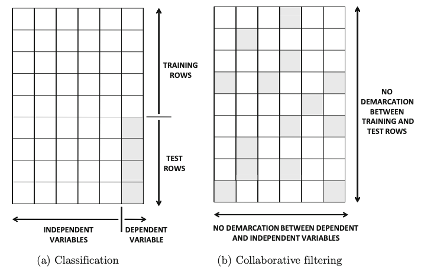
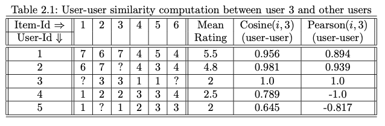
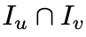
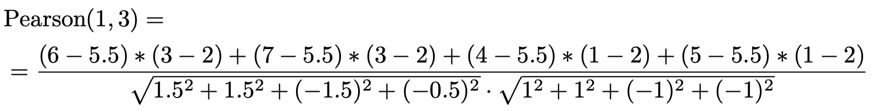

# Theoretical Fundamentals
At the beginning of this document we would like to over you some theoretical fundamentals for recommender systems. This part was consciously added to this RMarkdown in order to over this script as a compact guide. 

Most of the recommender systems are based on two different types of datasets. As you can see by the following image, we can distinguish between these two based on the occur of missing values. 



As we remember from the previous slides, in the dataset of our project around 494 missing values have to be consider. Due to this high number, a prediction in terms of classification is not possible.

Even though we captured to work with a collaborative filtering, additional aspects have to be clarified. Again, based on the characteristics of our dataset we made further decisions, which leads us in the end to a recommender system which will be computed by a **collaborative filtering that is user based**.  

Last but not least we have to classify which distance measurement we would like to use for our user based - collaborative filtering algorithm. Possible measures would be the "cosine-distance" or a correlation based distance measure via the "pearson-correlation-coefficient". The following image can give you a first idea of these measurements in the case of collaborative filtering.



In order to compute the pearson-correlation-coefficient within in recommender systems with missing values, we need to determine the intersection of the users we want to compare:


If we consider the intersection and the formula for the pearson-correlation-coefficient, we get the following calculation: 



# The Code for the Recommender Systems
After talking about the theoretical fundamentals, we now can start with the code for our recommender system. 
The following packages will be used:
```{r warning=FALSE, message = FALSE}
library(recommenderlab)
library(readr)
library(tidyverse)
```

In next step we will read in our dataframe that have to be pre-processed in order to be converted to an **realRatingMatrix**. This matrix is an object out of the recommenderlab package:
```{r warning=FALSE, message = FALSE}
final_df <- read_csv("final_df.csv")
final_df[-1] <- na_if(final_df[-1], 1)

final_df <- as.matrix(final_df[,-1])
rownames(final_df) <- paste0("u", 1:120)
colnames(final_df) <- paste0("i", 1:50)
r <- as(final_df, "realRatingMatrix")
r
```


## Inspection of data set
General understanding of the object:
```{r}
str(r)

identical(as(r, "matrix"),final_df)

r_sample <- as(sample(r, 5), "list")
r_sample

rowMeans(sample(r, 5))
```

Histgramme:
```{r}
hist(getRatings(r), breaks=5)
hist(rowCounts(r), breaks=15)
hist(colMeans(r), breaks=15)
```

# Creating a recommender
By using the function **Recommender()** we create the object **recommenderRegistry** which can be used for different kind of recommender systems. Depending on the characteristics of you dataframe you have to check which options you would like to use. 
```{r}
recommenderRegistry$get_entries(dataType = "realRatingMatrix")
```

## User-Based Collaborative Filtering Model (UBCF)
This time we use the recommender method "UBCF" out of realRatingMatrix.
Therefore, we generate a recommender based on user-based collaborative filtering:
```{r}
r_model_2 <- Recommender(r[1:120], method = "UBCF",
  param=list(method="pearson"))

#r_model_2
#names(getModel(r_model_2))
#getModel(r_model_2)$method
```

### Recommendations
Recommendations are generated by **predict()**. In this example we are offering the top 15 recommendation for user.
In case the user is only unfamiliar with less than 15 Song, the prediction only covers the remaining ones. 
```{r}
recom2 <- predict(r_model_2, r[c(39,100,101,5)], n=15)
recom2
as(recom2, "list")
```

## A second example of a possible model
Another option we could test for our system would be the **popularity model**. In this case we generate a system that is focused on the popularity of an item (song with highest number of users which have the song in their profile). This approach then would represent an item-based approach because instead of compute calculations over the observations we now compare the columns.
```{r}
r_model <- Recommender(r[1:120], method = "POPULAR")
r_model
```

```{r}
recom <- predict(r_model, r[c(39,100,101,5)], n=15)
recom
as(recom, "list")
```

For further inspirations please have a look into the documentation of the recommenderlab package:
https://cran.r-project.org/web/packages/recommenderlab/vignettes/recommenderlab.pdf)
